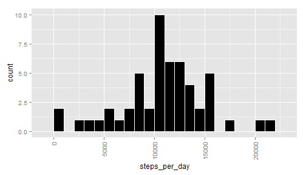

Reproducible Research Peer Assessment 1
=======================================

I load the libraries needed by my code and set the working directory.


```r
library(data.table)
library(ggplot2)
library(lubridate)
library(scales)

WD <- c("C:/Users/20537710/Documents/Coursera/Reproducible Research/Assignment-1")
setwd(WD)
```

Download the data and unzip it to the working directory.


```r
fileUrl <- "http://d396qusza40orc.cloudfront.net/repdata%2Fdata%2Factivity.zip"
download.file(fileUrl, destfile = "./activity.zip")
unzip("activity.zip", overwrite=TRUE)
```

Read the activity.csv file into a data table called activity and drop all the rows with 'NA'


```r
activity <- data.table(read.csv(file = "./activity.csv", sep=",", header = TRUE))
activity <- activity[complete.cases(activity),]
```

Change the 'date' column from type Factor to type 'Date'


```r
activity <- activity[, date := as.Date(date)]
```

Add the number of steps taken each day and create a new table with columns 'date' & 'steps_per_day'. Change the colnames for this table to be more intutive.


```r
stepsPerDay <- activity[ , sum(steps), by = date]
setnames(stepsPerDay, c("date", "steps_per_day"))
```

### What is the mean total number of steps taken per day?

Histogram of the total number of steps taken each day


```r
p <- ggplot(data = stepsPerDay, aes(x = steps_per_day)) + 
        geom_histogram(binwidth = 1000, colour="white", fill="black") +
        theme(axis.text.x = element_text(angle=90, vjust = 0.5, hjust = 1))

p
```

 


```r
mean <- stepsPerDay[, mean(steps_per_day)]
median <- stepsPerDay[, median(steps_per_day)]
```

The mean and median of the number of steps taken per day is 1.0766189 &times; 10<sup>4</sup> and 10765 respectively.

