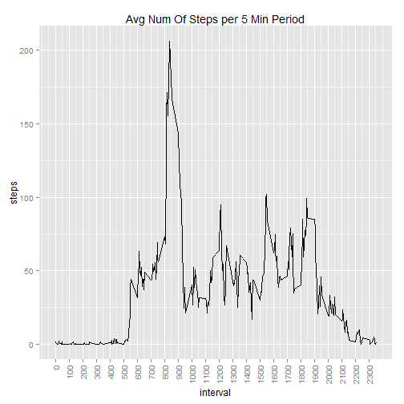
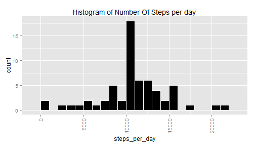
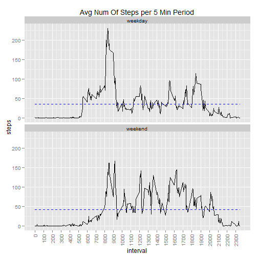

Reproducible Research Peer Assessment 1
=======================================

My R code needs the belowlibraries needed by my code.
Setup my working directory.


```r
library(data.table)
library(ggplot2)
library(lubridate)
library(knitr)

WD <- c("C:/Users/20537710/Documents/Coursera/Reproducible Research/Assignment-1/RepData_PeerAssessment1")
setwd(WD)
```

Download the data and unzip it to the working directory.


```r
fileUrl <- "http://d396qusza40orc.cloudfront.net/repdata%2Fdata%2Factivity.zip"
download.file(fileUrl, destfile = "./activity.zip")
unzip("activity.zip", overwrite=TRUE)
```

Read the activity.csv file into a data table called activity.


```r
activity <- data.table(read.csv(file = "./activity.csv", sep=",", header = TRUE))
```

Processing the raw data, drop all the NA's and change the 'date' column from type Factor to type 'Date'


```r
activityProcessed <- activity[complete.cases(activity),]
activityProcessed <- activityProcessed[, date := as.Date(date)]
```

Add the number of steps taken each day and create a new table with columns 'date' & 'steps_per_day'. Change the colnames for this table to be more intutive.


```r
stepsPerDay <- activityProcessed[ , sum(steps), by = date]
setnames(stepsPerDay, c("date", "steps_per_day"))
```

### What is the mean total number of steps taken per day?

Histogram of the total number of steps taken each day


```r
p <- ggplot(data = stepsPerDay, aes(x = steps_per_day)) + 
        ggtitle("Histogram of Number Of Steps per day") +
        geom_histogram(binwidth = 1000, colour="white", fill="black") +
        theme(axis.text.x = element_text(angle=90, vjust = 0.5, hjust = 1))

p
```

 


```r
mean1 <- stepsPerDay[, mean(steps_per_day, na.rm = TRUE)]
mean1
```

```
## [1] 10766.19
```

```r
median1 <- stepsPerDay[, median(steps_per_day, na.rm = TRUE)]
median1
```

```
## [1] 10765
```

The mean and median of the number of steps taken per day is 1.0766189 &times; 10<sup>4</sup> and 10765 respectively.

### What is the averge daily activity pattern

1: The below code gets the mean number of steps for each 5 min period.


```r
setkey(activityProcessed, interval)
stepsPerFiveMinIntv <- activityProcessed[ , mean(steps), by = interval]
setnames(stepsPerFiveMinIntv, c("interval", "steps"))
```

The below code generates the time series plot

```r
p <- ggplot(data = stepsPerFiveMinIntv, aes(x = interval, y = steps)) +
     geom_line() +
     ggtitle("Avg Num Of Steps per 5 Min Period") +
    scale_x_continuous(breaks = seq(0,2355,100)) +
    theme(axis.text.x = element_text(angle=90, vjust = 0.5, hjust = 1))

p
```

 

2: Which 5-minute interval, on average across all the days in the dataset, contains the maximum number of steps?

If you eyeball the graph it looks like the max number of steps taken is somewhere between the 825 and 850 time period lets say time period 837.


```r
stepsPerFiveMinIntv <- setorder(stepsPerFiveMinIntv, -steps)
period <- head(stepsPerFiveMinIntv, 2)
period
```

```
##    interval    steps
## 1:      835 206.1698
## 2:      840 195.9245
```

### Imputing Missing values


```r
mna <- sum(is.na(activity))
```
1. Total number of rows with NA's = 2304

2: Imputing strategy

I used the for loop to impute NA values, the logic for imputing is to use the 5 min mean for a time period, this has already been calculated in table 'stepsPerFiveMinIntv'. For e.g. the unprocessed table 'activity' has 

```
head(act)
   steps       date interval
1:    NA 2012-10-01        0
2:    NA 2012-10-01        5
```

I replace the NA's with the mean for the time period in table 'stepsPerFiveMinIntv'

```
head(stepsPerFiveMinIntv)
   interval steps
1:        0    NA
2:        5    NA
```

3: Crating a new dataset with imputed values
The for loop is a bit slow, however it works (I will have to figure out how to do the same using lapply or something like that)


```r
for (i in 1:nrow(activity)){
        if (is.na(activity$steps[i])){
                intvalue <- activity$interval[i]
                row_id <- which(stepsPerFiveMinIntv$interval == intvalue)
                stepsvalue <- stepsPerFiveMinIntv$steps[row_id]
                activity$steps[i] <- stepsvalue
        }
}
```


4: Histogram of the total number of steps taken each day using the imputed table


```r
stepsPerDayImpData <- activity[ , sum(steps), by = date]
setnames(stepsPerDayImpData, c("date", "steps_per_day"))
```


```r
p <- ggplot(data = stepsPerDayImpData, aes(x = steps_per_day)) + 
        geom_histogram(binwidth = 1000, colour="white", fill="black") +
        ggtitle("Histogram of Number Of Steps per day") +
        theme(axis.text.x = element_text(angle=90, vjust = 0.5, hjust = 1))

p
```

 


```r
mean2 <- stepsPerDayImpData[, mean(steps_per_day)]
mean2
```

```
## [1] 10766.19
```

```r
median2 <- stepsPerDayImpData[, median(steps_per_day)]
median2
```

```
## [1] 10766.19
```

The mean and median of the number of steps taken per day for the imputed data is 1.0766189 &times; 10<sup>4</sup> and 1.0766189 &times; 10<sup>4</sup> respectively.

### Are there differences in activity patterns between weekdays and weekends?

1: Creating a new column in the activity table 


```r
# Copy the date column from the activity table
dateVector <- activity[, date]

# convert the date to a wday using the Lubridate function
dateVector <- wday(dateVector, label = TRUE)

#substitue the abbreviated weekdays to two factors 'weekday' and 'weekend'
dateVector <- gsub("mon", "weekday", dateVector, ignore.case=TRUE)
dateVector <- gsub("tues", "weekday", dateVector, ignore.case=TRUE)
dateVector <- gsub("wed", "weekday", dateVector, ignore.case=TRUE)
dateVector <- gsub("thurs", "weekday", dateVector, ignore.case=TRUE)
dateVector <- gsub("fri", "weekday", dateVector, ignore.case=TRUE)
dateVector <- gsub("sat", "weekend", dateVector, ignore.case=TRUE)
dateVector <- gsub("sun", "weekend", dateVector, ignore.case=TRUE)

# add a new column to the imputed activity table and rename the column names
activity <- cbind(activity, dateVector)
activity <- transform(activity, dateVector = as.factor(dateVector))
setnames(activity, c("dateVector"), c("wday"))
```

2: Panel plot of the weekday, weekend average steps.


```r
setkey(activity, interval, wday)
weekWeekendActivity <- activity[ , mean(steps), by = c("interval", "wday")]

setnames(weekWeekendActivity, c("V1"), c("steps"))

p <- ggplot(data = weekWeekendActivity, aes(x = interval, y = steps)) +
     geom_line() +
     ggtitle("Avg Num Of Steps per 5 Min Period") +
     geom_line(stat = 'hline', yintercept = 'mean', color = 'blue', , linetype = 2) +
     scale_x_continuous(breaks = seq(0,2355,100)) +
     theme(axis.text.x = element_text(angle=90, vjust = 0.5, hjust = 1)) +
     facet_wrap(~wday, ncol=1)
     
p
```

 

The blue line shows that the average number of steps taken is little higher on weekends than weekdays. This means the test candidates are more active ob the weekend.

